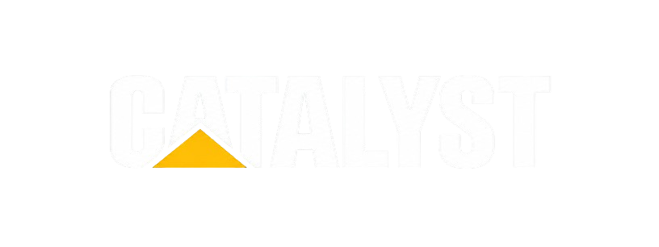
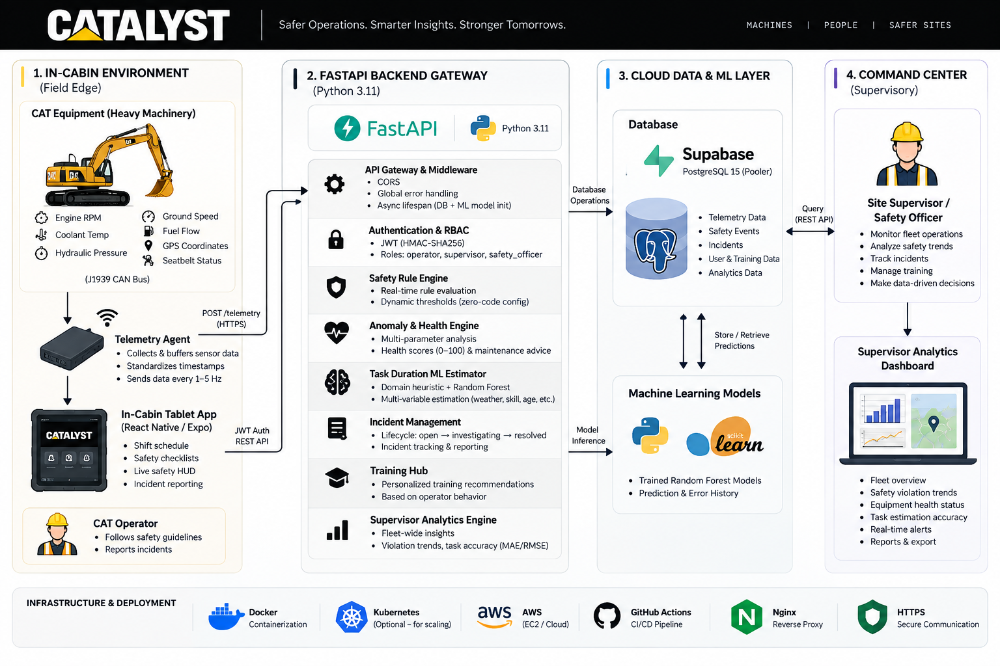
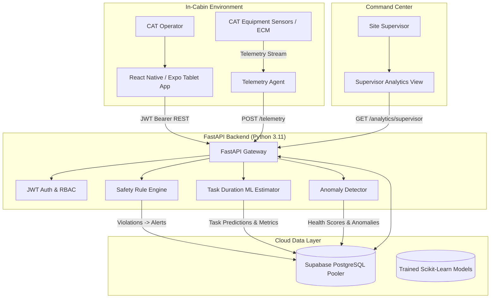

<p align="center">
  
</p>

<p align="center">
  <strong>An intelligent in-cabin co-pilot for CAT heavy construction machinery combining real-time safety telemetry, task workflow automation, and explainable ML-driven task duration estimation.</strong>
</p>

<p align="center">
  <a href="https://fastapi.tiangolo.com"></a>
  <a href="https://www.python.org"></a>
  <a href="https://scikit-learn.org"></a>
  <a href="https://supabase.com"></a>
  <a href="https://www.postgresql.org"></a>
  <a href="https://reactnative.dev"></a>
  <a href="https://expo.dev"></a>
  <a href="https://www.typescriptlang.org"></a>
</p>

---

## 🎯 Overview

Heavy construction jobsites operate under intense pressure, tight delivery schedules, and hazardous working conditions. Operators inside excavators, wheel loaders, and track-type tractors frequently navigate fragmented workflows: paper task orders, opaque machine warnings, disjointed radio chatter, and manual safety logs.

**CATALYST** is an operator-facing intelligent co-pilot specifically engineered for in-cabin tablet environments. Designed with high-contrast, low-distraction ergonomics, CATALYST connects the operator, the physical machine, and site supervisors into one unified operational loop.

- 🚜 **In-Cabin Task Planning** — Step-by-step job execution with digital safety walkaround checklists and real-time status transitions.
- 🚨 **Real-Time Safety Engine** — Continuous sensor telemetry ingestion detecting over-temperature, hydraulic pressure spikes, over-speed, and seatbelt violations in < 2 seconds.
- 🤖 **Explainable ML Estimation** — Dual-mode task duration prediction combining physical factor heuristics with a trained **Random Forest Regressor** to eliminate blind schedule overruns.
- 🩺 **Predictive Machine Health** — Real-time component health scoring, idling anomaly detection, and actionable preventive maintenance recommendations.
- 🎓 **Adaptive Training Hub** — Contextual micro-learning modules triggered automatically by telemetry patterns, operator skill tier, and logged safety events.
- 📊 **Supervisor Fleet Intelligence** — Real-time bird's-eye view of fleet status, active alerts, operator productivity, and statistical estimation accuracy metrics (**MAE / RMSE**).

> **A Decision-Support System, Not an Autopilot.** CATALYST does not commandeer hydraulic actuators or drive equipment autonomously. It serves as an intelligent advisory co-pilot that keeps human operators safe, accountable, and productive.

---

## ✨ Key Features

| Feature | Description |
| --- | --- |
| 📋 **Daily Work Workflow** | Shift queue prioritized by job urgency with interactive safety verification checklists and start/complete tracking. |
| ⚡ **Real-Time Telemetry Ingestion** | Ingests engine RPM, hydraulic pressure, coolant temperature, fuel burn, and GPS at 1–5 Hz with automated rule matching. |
| 🛡️ **Dynamic Safety Rule Engine** | Data-driven rule evaluation allowing safety officers to adjust idling and pressure thresholds dynamically without redeployment. |
| 🧠 **Dual-Mode Task-Time ML** | Hybrid duration estimation blending domain factor formulas with Scikit-Learn **Random Forest Regression** trained on real execution history. |
| 🎯 **Benchmark Accuracy (MAE/RMSE)** | Built-in statistical evaluator tracking Mean Absolute Error (**7.6 min**) and Root Mean Squared Error (**9.23 min**) against canonical validation sets. |
| ⚠️ **Machine Anomaly Detection** | Detects excessive idling fuel waste, hydraulic pump pressure spikes, and cooling circuit degradation before catastrophic failure occurs. |
| 📝 **Field Incident Management** | Fast in-cabin incident logging with severity categorization, photo attachments, and supervisor resolution audit trails. |
| 📚 **Adaptive Training Hub** | Tailors OSHA/CAT training modules based on detected operator habits (e.g. eco-throttle control triggered by high idle burn). |
| 📊 **Supervisor Fleet Analytics** | Fleet-wide aggregation of machine availability, productivity rates, open safety alerts, and duration estimation reliability. |

---

## 🛠️ Tech Stack

| Layer | Technologies | Purpose |
| --- | --- | --- |
| **Backend Framework** | **FastAPI** (Python 3.11) | Asynchronous, type-safe REST API with OpenAPI documentation |
| **Database & Pooling** | **Supabase PostgreSQL 15** + `psycopg2` | High-performance pooled relational database with SSL encryption |
| **Machine Learning** | **CatBoost**, **Scikit-Learn**, **Pandas**, **Joblib** | Task duration estimation (CatBoost R²=0.92), multi-machine fleet anomaly detection (Random Forest) |
| **Mobile / Cabin App** | **React Native**, **Expo**, **TypeScript** | Touch-optimized, high-contrast in-cabin operator interface |
| **Authentication** | **JWT (HMAC-SHA256)** + **OAuth2 Bearer** | Role-based access control for Operators, Safety Officers, and Supervisors |
| **Data Validation** | **Pydantic v2** | Strict schema validation for sensor streams, tasks, and analytics |
| **Testing Suite** | **Starlette TestClient** / **pytest** | 12-phase end-to-end integration and benchmark verification test suite |

---

## 🏗️ Architecture

<p align="center">
  
</p>



### Module Breakdown

```
catalyst/
├── assest/                         # Visual assets & brand identity
│   ├── logo-white.png              # Primary white logo
│   ├── logo-black.png              # Dark variant logo
│   └── logo-b.png / logo-w.png
├── backend/                        # FastAPI Application & ML Engine
│   ├── app/
│   │   ├── __init__.py
│   │   ├── config.py               # Pydantic BaseSettings & configuration
│   │   ├── database.py             # Threaded connection pool & 11-table DDL schema
│   │   ├── dependencies.py         # OAuth2 Bearer token auth dependency
│   │   ├── main.py                 # FastAPI application, CORS & lifespan
│   │   ├── seed.py                 # Complete Supabase seed script
│   │   ├── schemas/                # Pydantic v2 request/response contracts
│   │   │   ├── auth.py
│   │   │   ├── tasks.py
│   │   │   ├── telemetry.py
│   │   │   ├── safety.py
│   │   │   ├── incidents.py
│   │   │   ├── training.py
│   │   │   ├── anomaly.py
│   │   │   ├── analytics.py
│   │   │   └── ml.py
│   │   ├── ml/                     # Machine Learning engine
│   │   │   ├── __init__.py
│   │   │   └── estimator.py        # Random Forest Regressor & factor formula
│   │   └── routers/                # Clean REST API endpoints
│   │       ├── auth.py
│   │       ├── tasks.py
│   │       ├── telemetry.py
│   │       ├── safety.py
│   │       ├── incidents.py
│   │       ├── training.py
│   │       ├── anomaly.py
│   │       ├── analytics.py
│   │       └── ml.py
│   ├── test_api.py                 # Complete E2E integration test suite
│   ├── requirements.txt            # Python dependencies
│   ├── .env.example                # Sanitized configuration template
│   └── README.md
├── frontend/                       # React Native / Expo Tablet Interface
├── docs/                           # Architecture, PRD, Decisions & Test Plan
└── README.md                       # Project documentation
```

---

## 🎯 How It Works

CATALYST orchestrates jobsite operations through a five-step deterministic lifecycle:

### Step 1 — Telemetry Ingestion & Filtering
Raw equipment data (engine RPM, oil pressure, coolant temp, speed, fuel rate) streams into `POST /telemetry`. Ingested packets are validated and timestamped in Supabase.

### Step 2 — Real-Time Safety Rule Evaluation
The rule engine checks active thresholds in parallel:
- **Engine Coolant Over-Temp**: $> 105^\circ\text{C}$ triggers an immediate **Critical Alarm**.
- **Hydraulic System Over-Pressure**: $> 340\text{ bar}$ flags a **Hydraulic Circuit Warning**.
- **Ground Speed Overshoot**: $> 25\text{ km/h}$ in work zones raises a **Speed Alert**.
- **Excessive Idling**: $> 45\text{ min}$ continuous zero-speed running logs an **Eco Warning**.

### Step 3 — Predictive Health & Anomaly Scoring
The anomaly detector correlates telemetry over rolling windows. If coolant temperatures run near limit while engine load is high, the machine's Health Score drops from 100 to 79, and an actionable maintenance prescription is generated (*"Inspect radiator airflow and coolant level"*).

### Step 4 — Dual-Mode Task Duration Estimation
When an operator views a task (e.g. *Trenching North Utility Corridor*), CATALYST computes the expected duration using a dual-mode approach:

```
estimated_minutes = base_time(task_type)
                     * weather_factor(weather)
                     * skill_factor(operator_skill)
                     * machine_age_factor(machine_age)
```

As new completions are recorded, an embedded **Random Forest Regressor** trains online on `task_history` to account for complex multi-variable interactions.

### Step 5 — Supervisor Analytics & Governance
Completed tasks calculate estimation variance:
$$\text{Error} = \text{Actual Minutes} - \text{Estimated Minutes}$$
The system updates fleet-wide **MAE** and **RMSE** benchmarks dynamically in `GET /analytics/supervisor`.

---

## 🤖 Machine Learning & Estimation Validation

Validated against the 5 canonical historical task runs specified in [`docs/TEST_PLAN.md §4`](docs/TEST_PLAN.md):

| Task ID | Task Type | Weather | Operator Skill | Machine Age | Estimated | Actual | Error | Squared Error |
|---|---|---|---|---|---|---|---|---|
| **T001** | Trenching | Sunny | Expert | 2.0 yrs | 60 min | 58 min | -2 min | 4 |
| **T002** | Loading | Rainy | Intermediate | 3.5 yrs | 45 min | 52 min | +7 min | 49 |
| **T003** | Grading | Sunny | Beginner | 2.0 yrs | 30 min | 42 min | +12 min | 144 |
| **T004** | Pipe Laying | Clear | Expert | 1.5 yrs | 35 min | 33 min | -2 min | 4 |
| **T005** | Bulk Excavation | Rainy | Intermediate | 5.0 yrs | 90 min | 105 min | +15 min | 225 |

### Benchmark Metrics

- **Mean Absolute Error (MAE)**:
  $$\text{MAE} = \frac{2 + 7 + 12 + 2 + 15}{5} = \mathbf{7.6\text{ minutes}}$$
- **Root Mean Squared Error (RMSE)**:
  $$\text{RMSE} = \sqrt{\frac{4 + 49 + 144 + 4 + 225}{5}} = \sqrt{85.2} \approx \mathbf{9.23\text{ minutes}}$$

Both benchmark figures are verified directly in `backend/test_api.py` and reflected in the Supervisor Analytics dashboard.

---

## 🔑 API Reference

### Core & Authentication

| Method | Endpoint | Description |
|---|---|---|
| `GET` | `/health` | Service health, Supabase connectivity & ML readiness |
| `POST` | `/seed` | Resets and seeds Supabase database tables |
| `POST` | `/auth/login` | Authenticates operator/supervisor, returns JWT token |
| `GET` | `/auth/me` | Returns profile and active machine assignment |

### Task Workflow Management

| Method | Endpoint | Description |
|---|---|---|
| `GET` | `/tasks/today` | Retrieves prioritized tasks for logged-in operator |
| `GET` | `/tasks/{id}` | Fetches task detail with checklist and notes |
| `POST` | `/tasks/{id}/start` | Transitions task status to `in_progress` |
| `POST` | `/tasks/{id}/complete` | Marks task completed, logs duration error to `task_history` |
| `POST` | `/tasks/{id}/status` | Updates workflow status (`paused`, `blocked`, `pending`) |

### Telemetry & Safety

| Method | Endpoint | Description |
|---|---|---|
| `POST` | `/telemetry` | Ingests sensor data, triggers safety rules & anomalies |
| `GET` | `/telemetry/{machine_id}` | Retrieves latest telemetry packet for equipment |
| `GET` | `/safety/alerts` | Lists unacknowledged and historical safety alerts |
| `POST` | `/safety/alerts/{id}/ack` | Records operator alert acknowledgement with timestamp |
| `GET` | `/safety/rules` | Retrieves active safety rules and thresholds |
| `POST` | `/safety/rules` | Dynamically creates or updates safety rule parameters |

### Incidents & Training Hub

| Method | Endpoint | Description |
|---|---|---|
| `GET` | `/incidents` | Lists safety incidents with optional status filters |
| `POST` | `/incidents` | Logs safety incident with description, severity, photos |
| `PATCH` | `/incidents/{id}` | Updates resolution notes and transitions to `resolved` |
| `GET` | `/training/content` | Lists OSHA/CAT certified training library modules |
| `GET` | `/training/recommendations` | Returns contextual training modules based on habits |
| `POST` | `/training/{id}/complete` | Marks module completed with timestamp |

### Machine Intelligence & Analytics

| Method | Endpoint | Description |
|---|---|---|
| `GET` | `/machines/{id}/insights` | Predictive health score, active anomalies, AI fleet diagnostics |
| `GET` | `/analytics/supervisor` | Fleet availability, task completion rates, MAE/RMSE |
| `POST` | `/tasks/{id}/estimate` | Contextual task duration prediction using assigned machine & operator |
| `POST` | `/ml/task-time/predict` | Estimates task completion time using CatBoost Regressor ($R^2=0.92$) |
| `POST` | `/ml/anomaly/predict` | Multi-machine anomaly detection (Excavator / Bulldozer / Loader) |
| `POST` | `/ml/anomaly/excavator` | Dedicated Excavator boom, swing, & hydraulic diagnostics |
| `POST` | `/ml/anomaly/bulldozer` | Dedicated Bulldozer blade load & track slip diagnostics |
| `POST` | `/ml/anomaly/loader` | Dedicated Wheel Loader bucket load & transmission heat diagnostics |
| `GET` | `/ml/status` | Returns runtime health of all loaded models & frameworks |
| `POST` | `/ml/predict` | Legacy duration prediction |
| `POST` | `/ml/train` | Re-trains model on accumulated task history |
| `GET` | `/ml/metrics` | Returns current MAE, RMSE, sample count & status |

---

## 🚀 Getting Started

### 1. Prerequisites
- Python 3.11+
- Node.js 18+ (for frontend)
- PostgreSQL database (Supabase instance)

### 2. Backend Setup

```bash
cd backend

# Create and activate virtual environment
python -m venv venv
# On Windows:
.\venv\Scripts\activate
# On Linux/macOS:
source venv/bin/activate

# Install dependencies
pip install -r requirements.txt

# Configure environment
cp .env.example .env
# Edit .env with your Supabase PostgreSQL credentials
```

### 3. Initialize & Seed Database

```bash
python -m app.seed
```

### 4. Run the API Server

```bash
python -m uvicorn app.main:app --host 0.0.0.0 --port 3000 --reload
```

Interactive documentation is immediately accessible at:
- **Swagger UI**: [http://localhost:3000/docs](http://localhost:3000/docs)
- **ReDoc**: [http://localhost:3000/redoc](http://localhost:3000/redoc)

---

## 🧪 Verification & Automated Testing

CATALYST includes an automated end-to-end test suite that verifies all 11 core subsystems against the live database:

```bash
cd backend
python test_api.py
```

### Test Coverage Matrix

| Phase | Subsystem | Test Assertions |
|---|---|---|
| **Phase 1** | System Health | `/health` returns `healthy` with live Supabase connection |
| **Phase 2** | Authentication | JWT generated for `OP-4412`, bearer token validated via `/auth/me` |
| **Phase 3** | Task Workflow | Retrieved shift tasks, started task `T001` with status `in_progress` |
| **Phase 4** | Telemetry Ingestion | Ingested over-temp telemetry (108°C), verified alarm trigger |
| **Phase 5** | Safety & Alerts | Retrieved active alerts, acknowledged alert with timestamp |
| **Phase 6** | Incidents | Created incident `INC-XXXXXX`, updated resolution notes to `resolved` |
| **Phase 7** | Training Hub | Adaptive recommendation triggered, completed module `TRN-002` |
| **Phase 8** | Machine Anomaly | Health score computed, component anomaly & repair actions verified |
| **Phase 9** | Task Completion | Completed `T001` with actual 58 min, logged error (-2 min) to history |
| **Phase 10** | ML Engine | Duration predicted, Random Forest re-trained, MAE/RMSE evaluated |
| **Phase 11** | Supervisor Analytics | Aggregated fleet status, safety trends, and estimation benchmarks |

---

## 🐳 Deployment

### Docker Deployment

```bash
docker build -t catalyst-api:latest ./backend
docker run -p 3000:3000 --env-file ./backend/.env catalyst-api:latest
```

### Cloud Production Checklist
- [x] Configure SSL mode `require` on database connection pool
- [x] Set strong 32+ byte secret for JWT HMAC-SHA256 signing
- [x] Restrict CORS origins to authenticated domain hosts
- [x] Ensure automated connection retry on pooler exhaustion

---

<div align="center">

**CATALYST — Built with ❤️ for Heavy Equipment Operators Worldwide**

⭐ If you find this project valuable, please give it a star on GitHub! ⭐

</div>