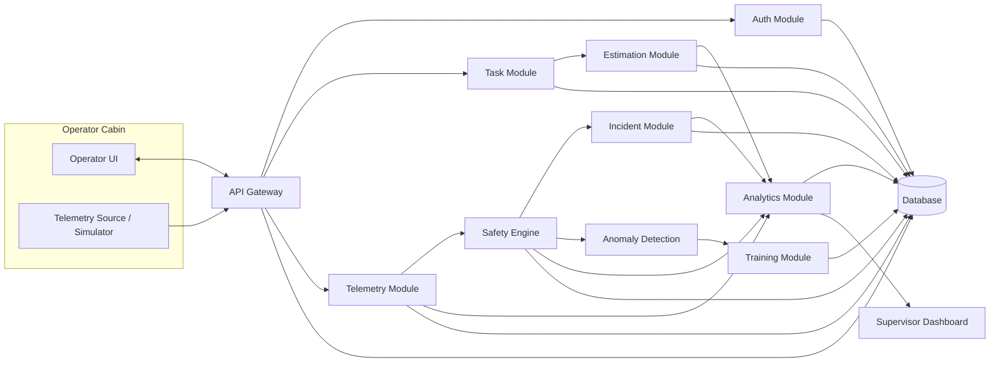
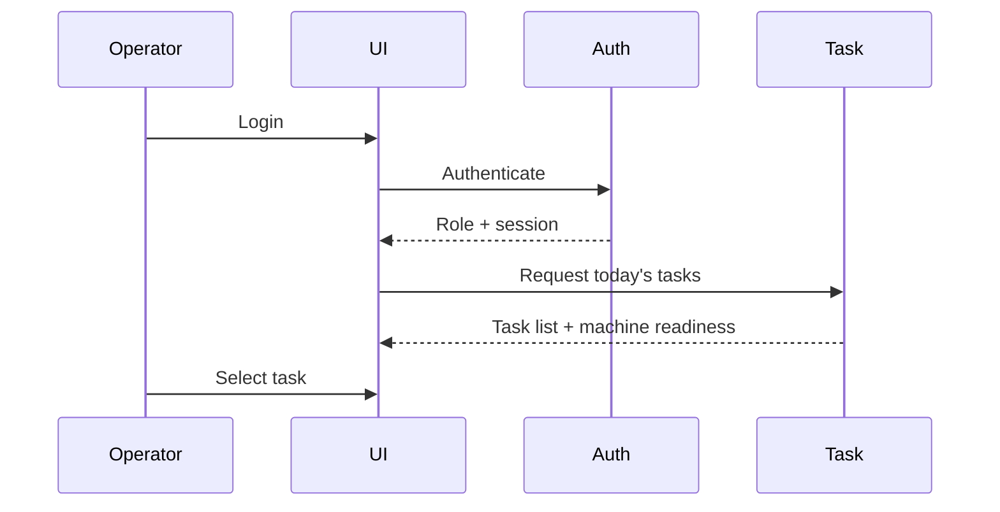
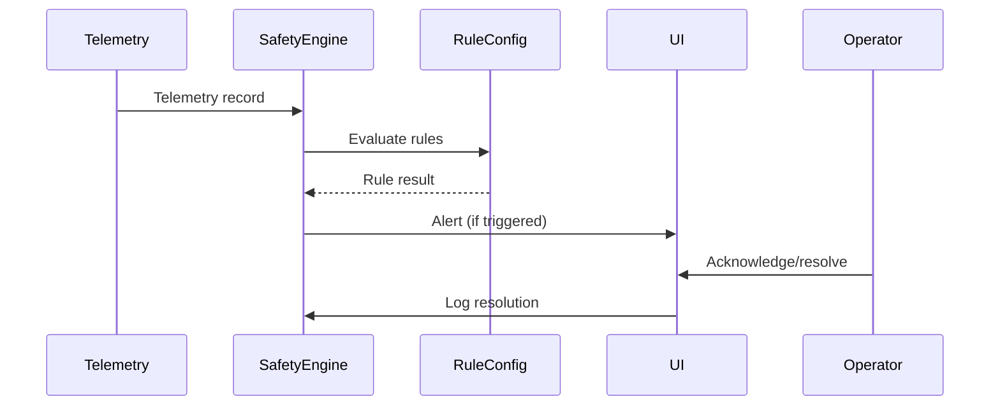
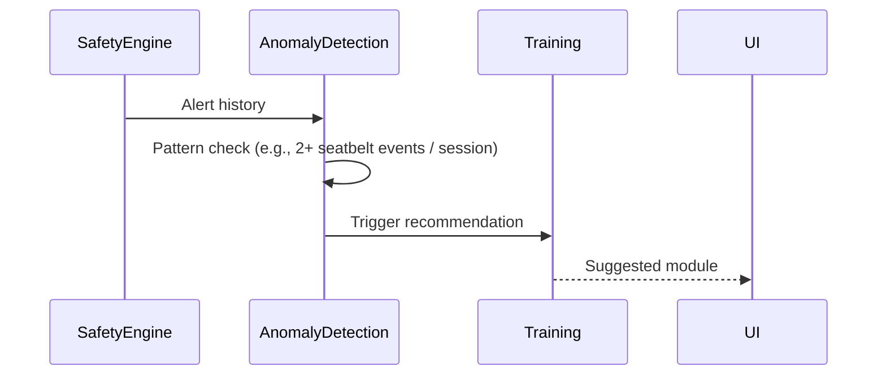
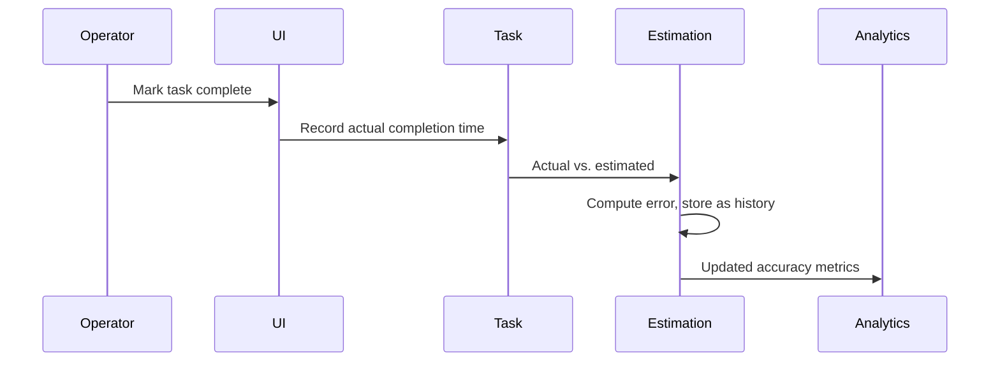

# CATALYST — Architecture Document

**Project:** Smart Operator Assistant for CAT Machinery
**Team:** H1B Visa

---

## 1. Architectural Goals

- **Modularity** — each capability (safety, incidents, training, etc.) is an independently testable module.
- **Extensibility** — the rule engine and estimation engine must accept new rules/models without redesign.
- **Transparency** — safety and estimation logic must be explainable, not a black box, given the hackathon's data constraints.
- **Resilience** — cabin connectivity may be intermittent; telemetry ingestion should tolerate short gaps.
- **Separation of control vs. insight** — the system reads telemetry and advises; it never writes to machine control systems.

## 2. High-Level System Diagram



## 3. Module Breakdown

| Module | Responsibility | Key Inputs | Key Outputs |
|---|---|---|---|
| **Auth** | Login, role resolution, session management | Credentials | Session token, role, permitted screens |
| **Task** | Daily task assignment, status, instructions | Schedule data, task type | Task list, task detail, status transitions |
| **Telemetry** | Ingest and store machine telemetry | Raw telemetry stream/sample | Normalized telemetry records |
| **Safety Engine** | Evaluate telemetry against configurable rules | Telemetry, rule config | Alerts (warning/critical), alert log |
| **Incident** | Create/track/resolve incident records | Operator input, linked alert | Incident record, supervisor notification |
| **Training** | Serve content, recommend based on safety patterns | Safety event history, catalog | Content list, recommendations, completion status |
| **Anomaly Detection** | Detect excessive idling / unsafe patterns | Telemetry history | Anomaly insight + explanation |
| **Estimation** | Predict task duration; record actual vs. estimate | Task type, weather, skill, machine age, history | Estimated duration, confidence, error on completion |
| **Analytics** | Aggregate safety, usage, and estimation accuracy | All module outputs | Supervisor dashboards, trend data |

## 4. Data Flow

### 4.1 Start Shift



### 4.2 During Operation



### 4.3 Repeated Safety Issue



### 4.4 Complete Task



## 5. Proposed Tech Stack (hackathon-appropriate)

| Layer | Choice | Rationale |
|---|---|---|
| Frontend | React (Vite) + Tailwind CSS | Fast to build, componentized dashboards, good for demo polish |
| State/data fetching | React Query or simple fetch + context | Lightweight, no over-engineering for a 4-person hackathon team |
| Backend | Node.js + Express | Matches team familiarity with a JS-first stack, quick REST setup |
| Database | SQLite (dev) → PostgreSQL (path to production) | SQLite needs zero setup for a demo; schema is portable to Postgres |
| Real-time updates | WebSocket (Socket.IO) or short polling | Live Safety View needs near-real-time alert delivery |
| Auth | Simple JWT-based session with role claim | Enough to demonstrate 5-role RBAC without a full IAM system |
| Charts | Recharts or Chart.js | Supervisor Analytics and Machine Insights trend views |

> This stack is a recommendation based on typical hackathon constraints and the team's likely web-first tooling. Swap freely if the team has stronger existing tooling (e.g., a different backend framework); the module boundaries above stay the same regardless of stack.

## 6. Database Schema (core tables)

```
users(id, name, role, email, created_at)
machines(id, model, age_years, status)
tasks(id, machine_id, operator_id, task_type, weather, status,
      estimated_minutes, actual_minutes, confidence, scheduled_at, completed_at)
telemetry(id, machine_id, operator_id, ts, engine_hours, fuel_used_l,
          load_cycles, idling_minutes, seatbelt_status, alert_triggered)
safety_rules(id, name, condition_json, severity, threshold, enabled)
alerts(id, machine_id, operator_id, rule_id, severity, ts, status, resolved_at)
incidents(id, operator_id, machine_id, alert_id_nullable, category,
          severity, description, status, created_at, updated_at)
training_content(id, title, format, target_pattern, url)
training_completions(id, operator_id, content_id, completed_at)
anomalies(id, machine_id, operator_id, type, explanation, ts)
task_history(id, task_type, weather, operator_skill, machine_age,
             estimated_minutes, actual_minutes, error_minutes)
```

## 7. Safety Rule Engine Design

Rules are stored as **data, not code**, so thresholds are configurable per site/machine without redeployment.

Example rule representation:

```json
{
  "name": "seatbelt_unfastened_active",
  "condition": { "seatbelt_status": "Unfastened", "machine_active": true },
  "severity": "critical"
}
```

```json
{
  "name": "excessive_idling",
  "condition": { "idling_minutes": { "gt": 45 } },
  "severity": "warning"
}
```

Evaluation loop (conceptual):

```
for each incoming telemetry record:
    for each enabled rule:
        if rule.condition matches record:
            emit alert(rule.severity, record, rule)
```

This keeps the engine simple, testable against the sample data, and easy to extend (e.g., adding a proximity-zone rule later just means adding a new JSON rule, not new code paths).

## 8. Task-Time Estimation Engine Design

**Phase 1 (hackathon/MVP) — transparent formula:**

```
estimated_minutes = base_time(task_type)
                     * weather_factor(weather)
                     * skill_factor(operator_skill)
                     * machine_age_factor(machine_age)
```

Where each factor is a small lookup table derived from the historical task records (e.g., "Rainy" adds a multiplier because T002 ran over estimate in rain; "Beginner" adds a multiplier because T003 ran well over estimate). A **confidence score** is derived from how many similar historical records exist — with only 5 sample rows, confidence should visibly read as "low" until more data accumulates. This is intentional and stated in the PRD's non-goals.

**Phase 2 (post-hackathon path):** once enough `task_history` rows exist, replace the formula with a regression or tree-based model (e.g., gradient-boosted trees), trained on task_type, weather, operator_skill, machine_age, and evaluated with:

- **MAE** (Mean Absolute Error) — average magnitude of estimation error.
- **RMSE** (Root Mean Squared Error) — penalizes larger misses more heavily.

The interface contract (inputs → `{estimated_minutes, confidence}`) stays identical between phases, so the UI and downstream analytics don't change when the model is swapped.

## 9. API Endpoints Summary

| Method | Endpoint | Module | Purpose |
|---|---|---|---|
| POST | `/auth/login` | Auth | Authenticate, return role + token |
| GET | `/tasks/today` | Task | Today's tasks for logged-in operator |
| POST | `/tasks/:id/start` | Task | Mark task started |
| POST | `/tasks/:id/complete` | Task | Mark complete, trigger estimation error calc |
| POST | `/telemetry` | Telemetry | Ingest a telemetry record |
| GET | `/safety/alerts?machine_id=` | Safety Engine | Current/recent alerts |
| POST | `/safety/alerts/:id/ack` | Safety Engine | Acknowledge/resolve an alert |
| POST | `/incidents` | Incident | Create incident |
| GET | `/incidents` | Incident | List/filter incidents |
| PATCH | `/incidents/:id` | Incident | Update status |
| GET | `/training/recommendations` | Training | Personalized recommendations |
| GET | `/training/content` | Training | Browse catalog |
| POST | `/training/:id/complete` | Training | Mark completion |
| GET | `/machines/:id/insights` | Anomaly Detection | Idling/usage anomalies + explanations |
| GET | `/analytics/supervisor` | Analytics | Aggregated safety/usage/estimation metrics |

## 10. Non-Functional Considerations

- **Latency:** safety alerts should render within ~1–2 seconds of a triggering telemetry record in the demo.
- **Extensibility:** new rules and training content must be addable via configuration/data, not code changes.
- **Offline tolerance:** telemetry ingestion should buffer briefly on the client if the API is momentarily unreachable (relevant given cabin connectivity).
- **Auditability:** every alert, incident, and rule change should be timestamped and attributable to a user.

## 11. Deployment Architecture (Demo)

For the hackathon demo, a single-host deployment is sufficient:

```
Frontend (React) --served via Vite/static host--> Browser (tablet-simulated)
Backend (Express) --REST + WebSocket--> Frontend
SQLite file --local--> Backend
```

Telemetry can be injected via a small script or seeded dataset (the provided sample rows) to simulate live machine data without hardware integration.
